# Wire Frame Demo Application

## Original

https://jdk.java.net/java-se-ri/7
- jdk_ri-7u75-b13-windows-i586-18_dec_2014.zip
- -  java-se-7u75-ri\demo\applets\WireFrame

expanded source: 0_applet folder

## Step 1: migrate to Swing JFrame + Canvas

- source: 1_swing
- Java: OpenJDK 17.0.2

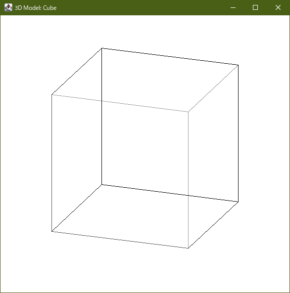 &nbsp; 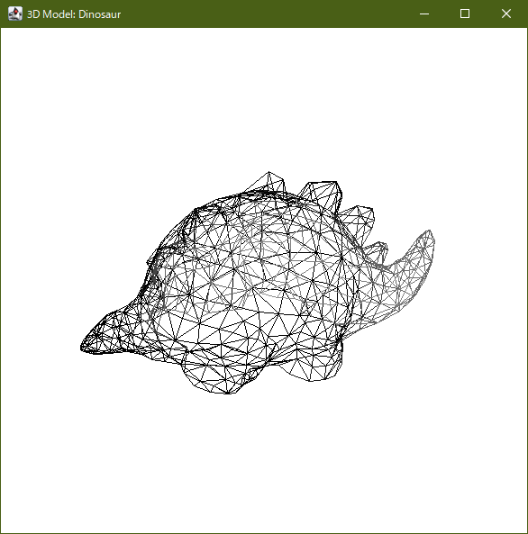

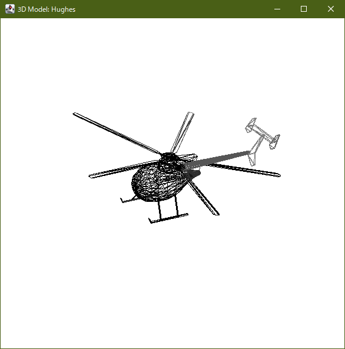 &nbsp; 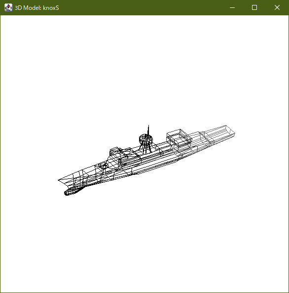

## Step 2: migrate to JavaFX + Canvas

- source: 2_jfx_canvas
- Java: OpenJDK 17.0.2
- JavaFX: OpenJFX SDK 17.0.2

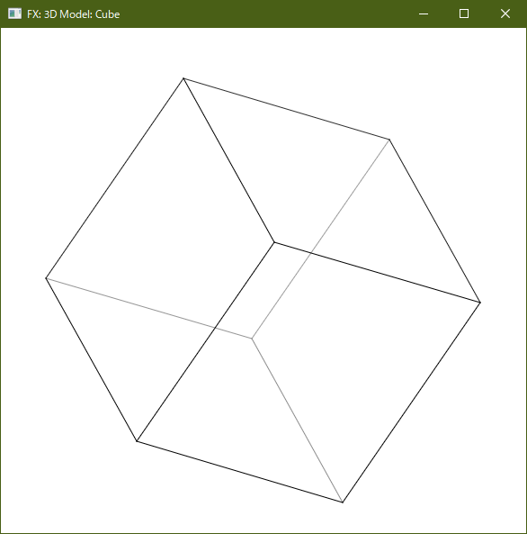 &nbsp; 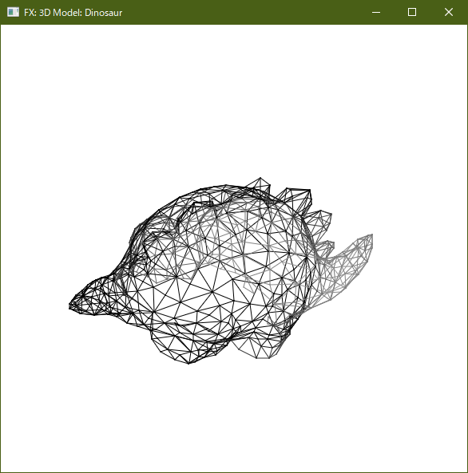

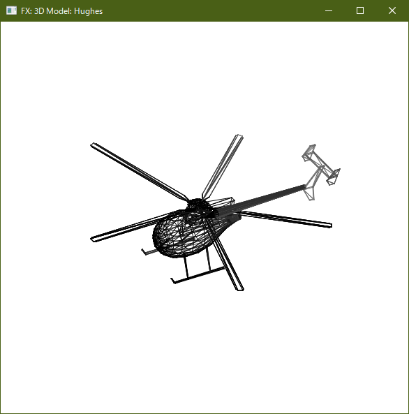 &nbsp; 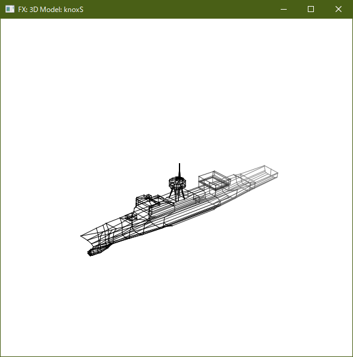

## Step 3: migrate to JavaFX + Mesh

- source: 3_jfx_mesh
- Java: OpenJDK 17.0.2
- JavaFX: OpenJFX SDK 17.0.2

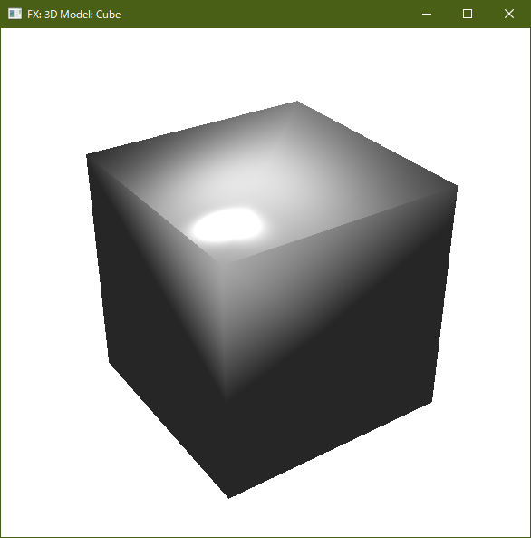 &nbsp; 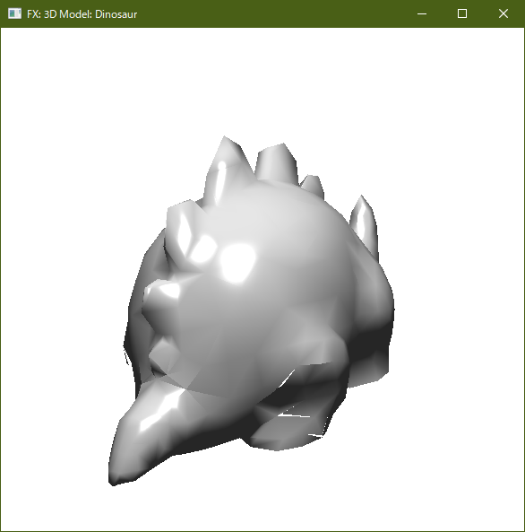

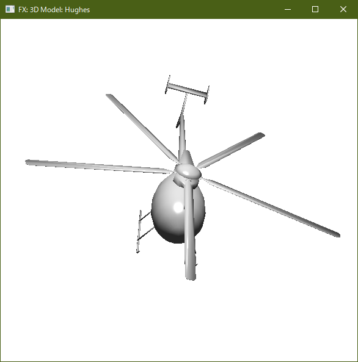 &nbsp; 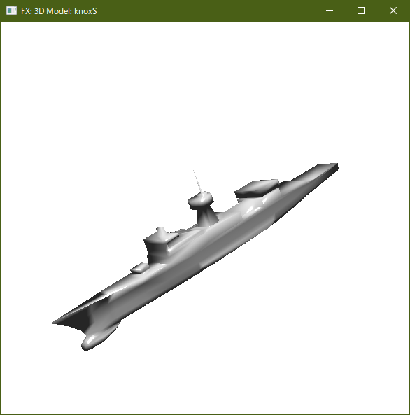
